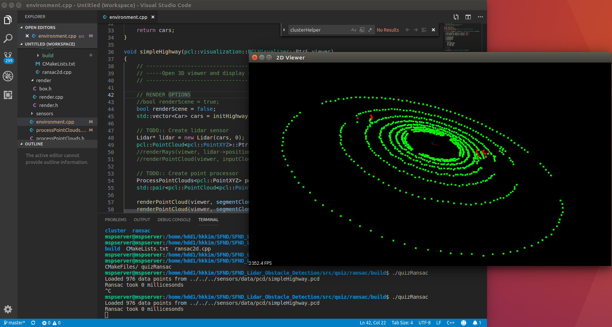
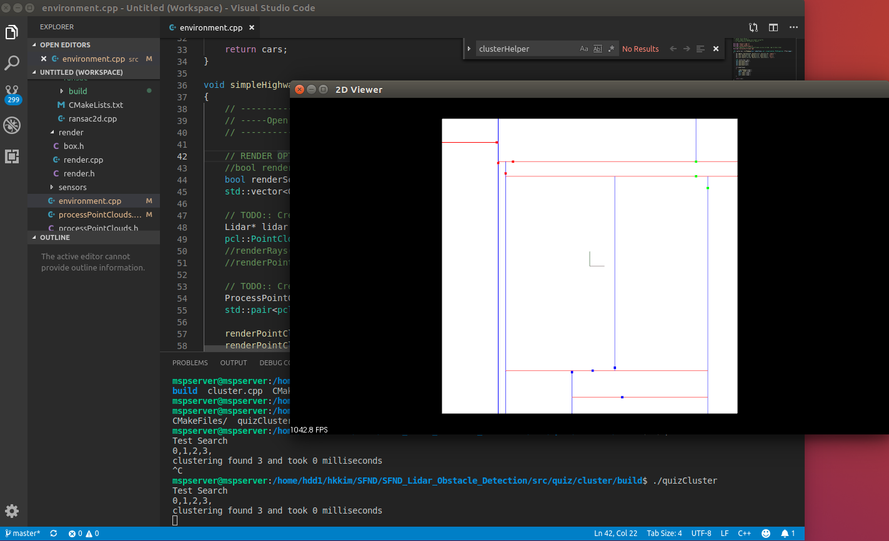
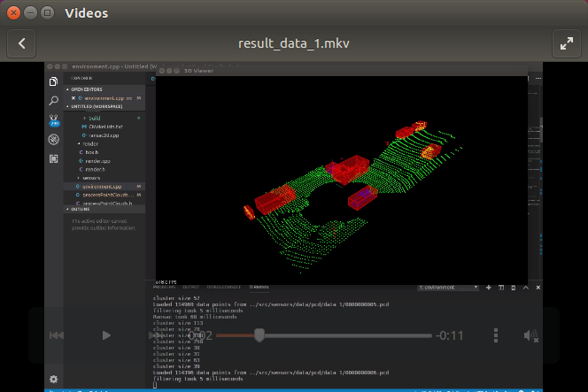
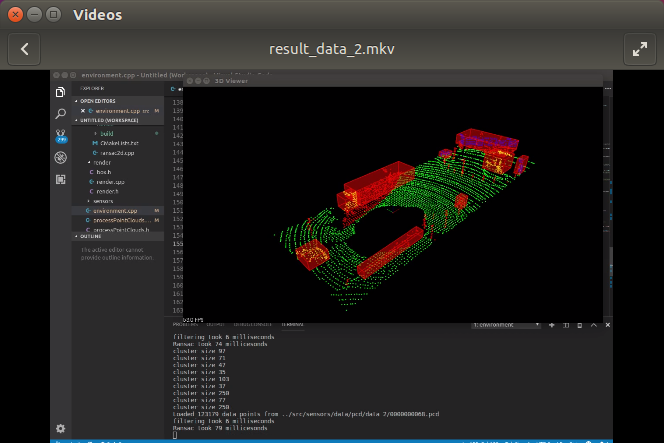

# Sensor Fusion Self-Driving Car Course

## Welcome to the Sensor Fusion course for self-driving cars.

In this course we will be talking about sensor fusion, whch is the process of taking data from multiple sensors and combining it to give us a better understanding of the world around us. we will mostly be focusing on two sensors, lidar, and radar. By the end we will be fusing the data from these two sensors to track multiple cars on the road, estimating their positions and speed.

**Lidar** sensing gives us high resolution data by sending out thousands of laser signals. These lasers bounce off objects, returning to the sensor where we can then determine how far away objects are by timing how long it takes for the signal to return. Also we can tell a little bit about the object that was hit by measuring the intesity of the returned signal. Each laser ray is in the infrared spectrum, and is sent out at many different angles, usually in a 360 degree range. While lidar sensors gives us very high accurate models for the world around us in 3D, they are currently very expensive, upwards of $60,000 for a standard unit.

**Radar** data is typically very sparse and in a limited range, however it can directly tell us how fast an object is moving in a certain direction. This ability makes radars a very pratical sensor for doing things like cruise control where its important to know how fast the car infront of you is traveling. Radar sensors are also very affordable and common now of days in newer cars.

**Sensor Fusion** by combing lidar's high resoultion imaging with radar's ability to measure velocity of objects we can get a better understanding of the sorrounding environment than we could using one of the sensors alone.

# CORE CURRICULUM (2): Lidar Obstacle Detection 

## 1. Results of Quiz and Project

### 1) Result of Quiz 1 (RANSAC)

### 2) Result of Quiz 2 (Clustering)

### 3) Result of Data1 in the Project 1 (SFND_Lidar_Obstacle_Detection)

<!--

(click on the image to open the video)
-->

### 4) Result of Data2 in the Project 1 (SFND_Lidar_Obstacle_Detection)

<!--

(click on the image to open the video)
-->

## 2. Dev-Env Installation of Quiz and Project

### 1) Ubuntu 

https://askubuntu.com/questions/916260/how-to-install-point-cloud-library-v1-8-pcl-1-8-0-on-ubuntu-16-04-2-lts-for

### 2) Windows 

http://www.pointclouds.org/downloads/windows.html

### 3) MAC

http://www.pointclouds.org/downloads/macosx.html
http://www.pointclouds.org/documentation/tutorials/installing_homebrew.php
